# HOTEL MANAGEMENT WEB APPLICATION

#### SUBMITTED BY

     Arghya Nayek
     Department:Information Technology
     College Name:Government College of Engineering and Textile Technology,Serampore

     Shritama Ghosh
     Department:Electronics and Communication Engineering
     College Name:Ramkrishna Mahato Government Engineering College(Earlier name Purulia Government Engineering College) 

#### UNDER THE GUIDANCE OF

         Mr.Asit Deva
         Mr.Hemant Baid
         Mr.Soumen De
         MR. Raveendran Vasudevan      
Year:2020

#### ACKNOWLEDGEMENT

The Internship opportunity I have with Siemens was a great chance for learning and professional developement. Therefore I consider myself a very happy individualas I was provided with an opportunity to be a part of it.I am also grateful for having a chance to meet so many wonderful people and personalities who helped me enough who help me through this internship period.
####

I would like to express my sincere gratitude to my supervisors Mr. Asit Deva , Mr. Hemant Baid, Mr. Soumen De , Mr.Raveendran Vasudevan for providing their invaluable guidance, comments and suggestions throughout the course of the project.

#### 
I would specially thank Mr. Asit Deva for constantly motivating me to work harder and for referring the required lessons and suggestions and Mr. Hemant Baid for providing me an overview of the documentation and other necessary details.
####
Also I would like to thank Mr. Soumen De for his assistance and  Mr. Raveendran Vasudevan for his help during the preparation of the project. My sincere thanks also go to all the representatives of Siemens Scholarship Program for their kind cooperation in all spheres during my project work.
####
 Last but not the least, I thank my parents and all my family members for their support and motivation they have provided throughout my project work.

* Arghya Nayek
* Shritama Ghosh

#### DECLARATION

We declare that this written submission represents our ideas in our own words and where others' ideas or words have been included, We have adequately cited and referenced the original sources. We also declare that we have adhered to all principles of academic honesty and integrity and have   not misrepresented or fabricated or falsified any idea/data/fact/source in my submission.We understand that any violation of the above will be cause for disciplinary action and can also evoke  penal action from the sources which have thus not been properly cited or from whom proper permission has not been taken when needed.

* Arghya Nayek
* Shritama Ghosh

## **A.Content**

## **1.High Level Description**

## **2.Technologies Used and Local Setup Details**

## **3.Design Docs and Diagrams**

### **3.1 Use Case Diagram**

### **3.2 Sequence Diagram**

#### 3.2.1 Sequence Daigram for Log-In for a Customer User

### **3.3 Activity Daigram**

#### 3.3.1 Activity Daigram for User Login

### **3.4 Component Daigram**

## **4. User Journeys**

## **1. High Level Description**

## INTRODUCTION

I have tried my best to make the complicated process of Online Hotel Management System as simple as possible using Structured & Modular technique & Menu oriented interface. I have tried to design the software in such a way that user may not have any difficulty in using this package & further expansion is possible without much effort. Even though I cannot claim that this work to be entirely exhaustive, the main purpose of my exercise is perform each Employee’s activity in computerized way rather than manually which is time consuming.

####

I am confident that this software package can be readily used by non-programmingpersonal avoiding human handled chance of error. This project is used by two types of users.
####
i.	Online Users.
ii.	Administrator (management of the Hotel). Online users can see the required articles or news
####
Administrator can maintain daily updates in the hotel records. Administrator is must be an authorized user. He can further change the password. There is the facility for passwordrecovery, logout etc.
The main aim of the entire activity is to automate the process of day to day activities of Hotel like Room activities, Admission of a New Customer, Assign a room according to customer’s demand, checkout of a computer and releasing the room etc.
####
The limited time and resources have restricted us to incorporate, in this project, only a main activities that are performed in a HOTEL Management System, but utmost care has been taken to make the system efficient and user friendly.
####
 “HOTEL Management System” has been designed to computerized the following functions that are performed by the system:
* Hotel Detail Functions
* Opening a Hotel
* Modification to Hotel assigned
* Check-in and check-out Detail Functions
* Admission of New customer
* Check-out of customer
* Room assigning related to customer’s need.
* Statement of Customer Details
* Check-in customer
* Check-out customer
* Room Details
* Individual customer Report

## Problem statement:-

 The project hotel management system is a web based application that allows the hotel manager(Admin Corner) to handle all hotel activities online. Interactive GUI and the ability to manage various hotel bookings and rooms make this system very flexible and convenient. The hotel manager is a very busy person and does not have the time to sit and manage the entire activities manually on paper. This application gives him the power and flexibility to manage the entire system from a single online system. Hotel management project provides room booking, staff management and other necessary hotel management features. The system allows the manager to post available rooms in the system. Customers can view and book room online. Admin has the power of either approving or disapproving the customer's booking request. Other hotel services can also be viewed by the customers and can book them too. 
The system is hence useful for both customers and managers to portably manage the hotel activities.

#### objective:-

During the past several decades personnel function has been transformed from a relatively obscure record keeping staff to central and top level management function. There are many factors that have influenced this transformation like technological advances, professionalism, and general recognition of human beings as most important resources.

* A computer based management system is designed to handle all the primary information required to calculate monthly statements. Separate database is maintained to handle all the details required for the correct statement calculation and generation.

* This project intends to introduce more user friendliness in the various activities such as record updation, maintenance, and searching.

* The searching of record has been made quite simple as all the details of the customer can be obtained by simply keying in the identification of that customer.

* Similarly, record maintenance and updation can also be accomplished by using the identification of the customer with all the details being automatically generated. These details are also being promptly automatically updated in the master file thus keeping the record absolutely up-to-date.

* The entire information has maintained in the database or Files and whoever wants to retrieve can’t retrieve, only authorization user can retrieve the necessary information which can be easily be accessible from the file.

* The main objective of the entire activity is to automate the process of day to day activities of Hotel like:

1.	Room activities,
2.	Admission of a New Customer,
3.	Assign a room according to customer’s demand,
4.	Checkout of a computer and releasing the room
5.	Advance online bookings.
6.	Online Cancellation.
7.	List of Regular customers.
8.	Email facility.
9.	Feedbacks
This project have some more features:

•	System Connectivity

•	No data duplication
•	No Paper Work Required

•	Time Efficient

•	Cost Efficient

•	Automatic data validation

•	User friendly environment

•	Data security and reliability

•	Fast data insertion & retrieval

•	Easy performance check
 ## Advantages:
* Sometimes it happens that the rooms get booked soon when one visits the place therefore user can make advance booking using this system.
 * It saves user time in search of rooms.
* The system is useful as it calculates an exact cost for requested number of days.
* It saves organization resources and expenses.
* This system is effective and saves time and cost of users.
* Easy registration
We are implementing a Web Service that will allow a user to :
  #### Login Page - 
    * Customer
    * Admin(Hotel Managers)
   #### Sign Up -
    * Customer
    * Admin(Hotel Managers)
 #### Log out -

* Customer
  * Admin(Hotel Manager)
 * Listing of Available Hotels 
 * Basic Listing of available hotels on a given day  
* Availability of Quarantine Center
* Availabilty of Monitoring System
* Booking of Hotels
* Cancelling the booking hotels if Customer want to cancel the booking  of hotels in the specific day
* After cancelling any booking hotels they can book hotel to follow same procedure on same day or another day as Customer wish.
* Customer can choice different hotels in 
 one place.
#### Forget Password:-
  If any customer forget their password in login time then they click forget password button and a new page open then when customer give their emailid ,their password is shown in our website.
#### Update hotels:-
Any Admin to enter our website by registered email id and password to add any new hotel or remove any hotel
#### Add Hotels
  * Admin(Hotel Managers)
####  Booking History
  * Admin(Hotel Managers)
#### Unique Advantage:-
 Any Customers who book hotels by our website frequently ,they have a unique advantage by our side.  
#### Feedback page:-
Customers have a feedback mail after check-out from hotels to give any feedback message to us ,they log in by their registered email and password.
* Before check-in time every customer has a mail and from our side also before check-out time ,they have a mail from our site because of reminder.
#### Admin login and admin dashboard: 
It has admin login who has the authority of the system and he is responsible for approving and disapproving the users request for room booking. Admin can add and delete notifications and updates in the system.
#### User Registration: 
There is user registration form available where new users can create their account by providing required information to the system.
#### Booking System: 
User can request for the table booking for a particular date and time.
#### Approving/Disapproving Request: 
The booking requests are directly sent 
with respective user details and therefore make decisions for cancelling the requests.
 ## **2. Technologies Used and Local Setup Details**
#### 1.Xampp software:-
XAMPP is a free and open-source cross-platform web server solution stack package developed by Apache Friends, consisting mainly of the Apache HTTP Server, MariaDB database, and interpreters for scripts written in the PHP and Perl programming languages.

#### 2. VISUAL STUDIO CODE:- 
(Visual Studio Code is a source-code editor developed by Microsoft for Windows, Linux and macOS. It includes embedded Git and support for debugging, syntax highlighting, intelligent code completion, snippets, and code refactoring.)

#### 3. INTERNET EXPLORER :-
(graphical web browsers developed by Microsoft and included in the Microsoft Windows line of operating systems)
## CODING LANGUAGES

#### 1.	HTML 
(Hypertext Markup Language is the standard markup language for documents designed to be displayed in a web browser)


### 2.	CSS 
(Cascading Style Sheets is a style sheet language used for describing the presentation of a document written in a markup language like HTML)


#### 3.	JAVASCRIPT 
(JavaScript (JS) is a lightweight, interpreted, or just-in-time compiled programming language with first-class functions. While it is most well-known as the scripting language for Web pages)

#### 4.PHP 
(PHP is a widely used server-side programming language that’s become increasingly fast and powerful over the years. PHP works well with HTML and databases, making it a great language for anyone interested in building dynamic web applications.)

#### 5.Mysql
 (Mysql is a standard language for storing, manipulating and retrieving data in databases.)
## **3. Design Docs and Diagrams**
### **3.1. Use Case Diagram**

* List of Users
  * Customer
  * Admin

* Use-Cases
  * Customer can Log-in
  * Admin can log-in
  * Customer can Sign Up
  * Admin can Sign Up
  * Customer can Log out  
  * Admin can Log-out 
  * Customer can make a booking
  * Customer can cancel a booking
  * Customer can update a booking
  * Admin can update hotels 
  * Admin can add hotels.
  * Customer can use Forget Password facility
  * Frequent Customer has unique Adavantage
  * Customer has feedback mail after  check-out 
  * Customer can check-in
* Customer can check-out
* Admin check feedback mail


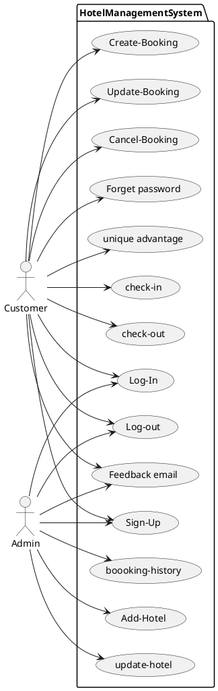
### **3.2 Sequence Daigram**

#### 3.2.1 Sequence Daigram for Log-In for a Customer User

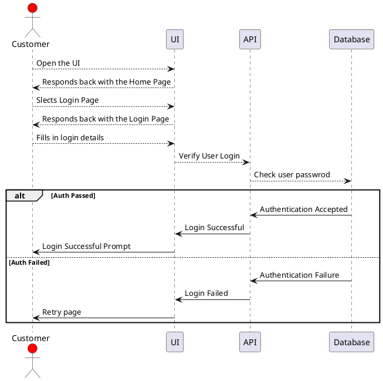
#### 3.2.2 Sequence Daigram for Log-In for an Admin user

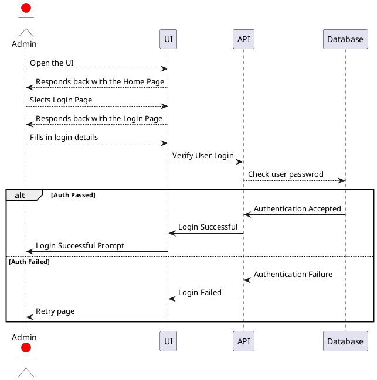
#### 3.2.3 Sequence Daigram for Sign-up for a Customer User

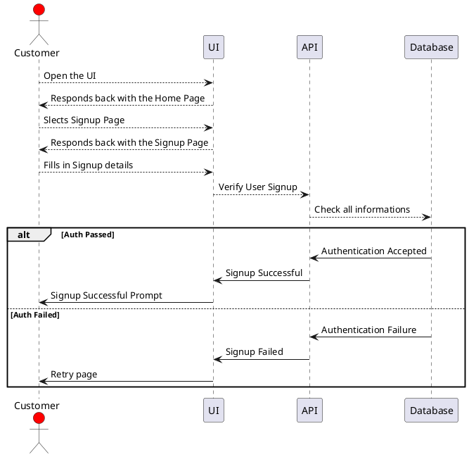
#### 3.2.4 Sequence Daigram for Sign-up for an Admin User

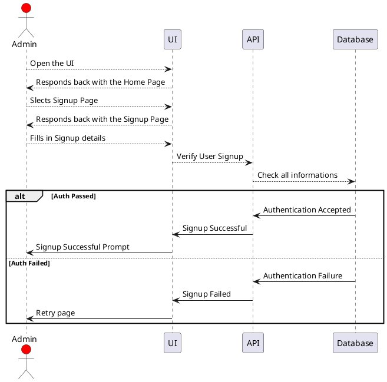
#### 3.2.5 Sequence Daigram for Log-out for a Customer User

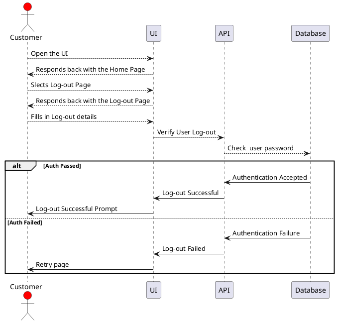
#### 3.2.6 Sequence Daigram for Log-out for an Admin User

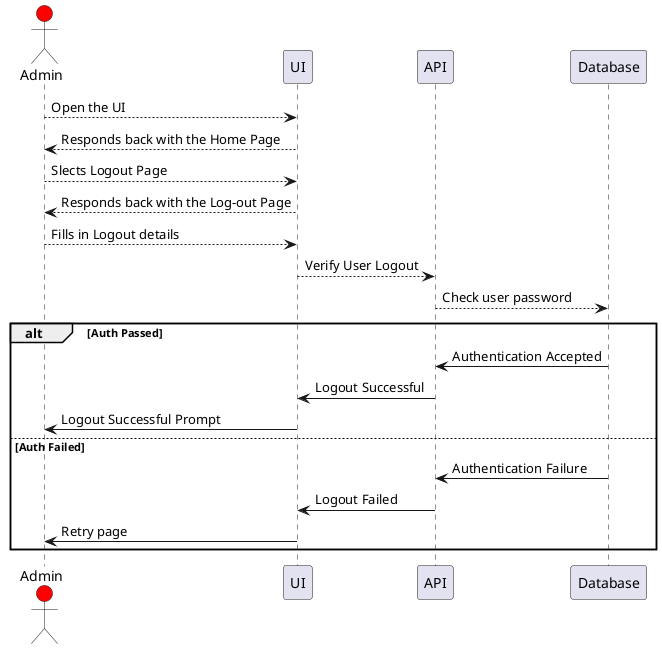
#### 3.2.7 Sequence Daigram for create booking for a Customer User

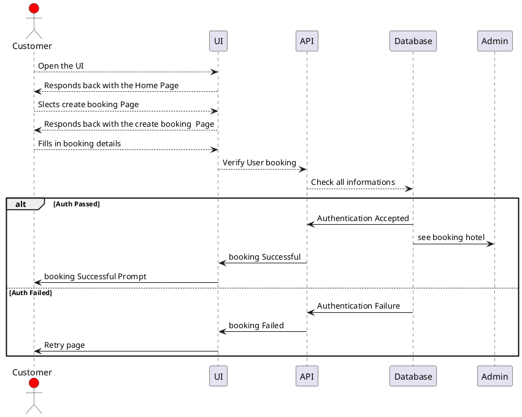
  #### 3.2.8 Sequence Daigram for Update booking for a Customer User

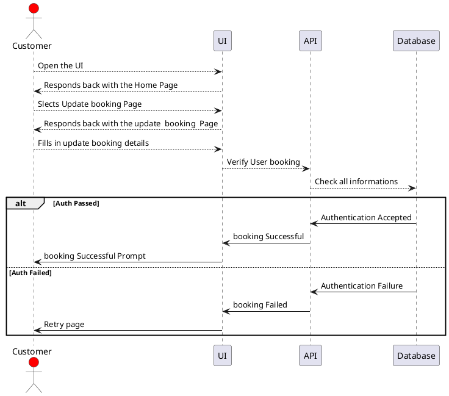
#### 3.2.9 Sequence Daigram for cancel booking for a Customer User

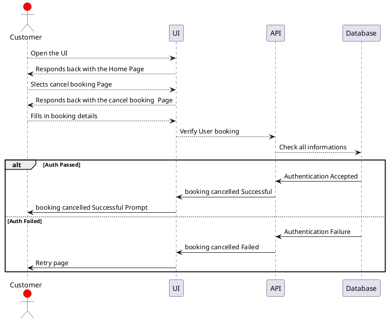

  #### 3.2.10 Sequence Daigram for Forget Password for a Customer User

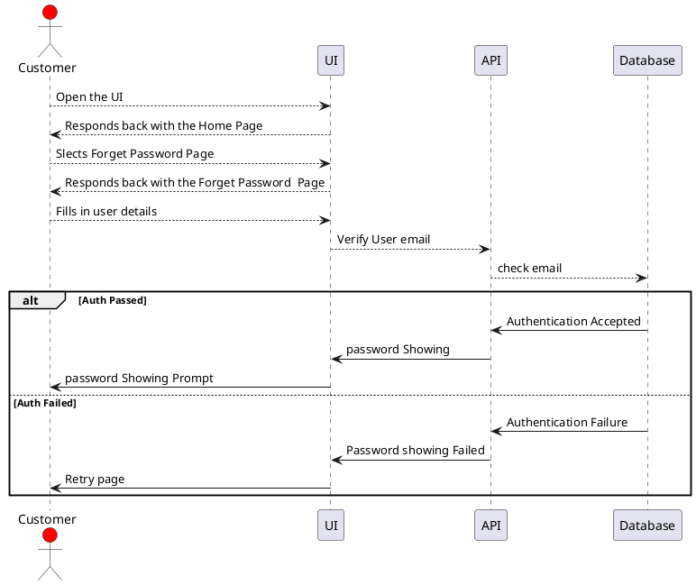
#### 3.2.11 Sequence Daigram for Feedback  email for a Customer User

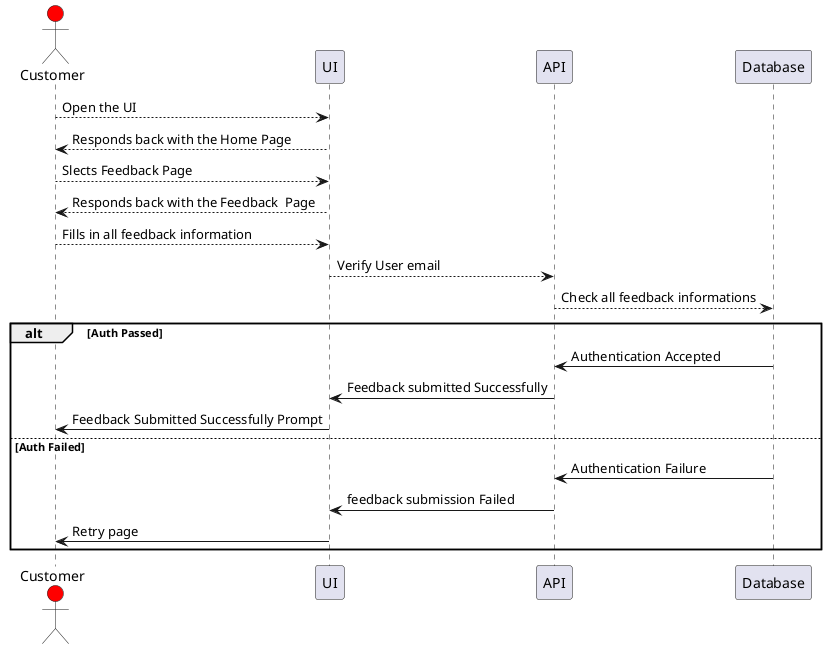
#### 3.2.12 Sequence Daigram for Add hotel for an Admin User

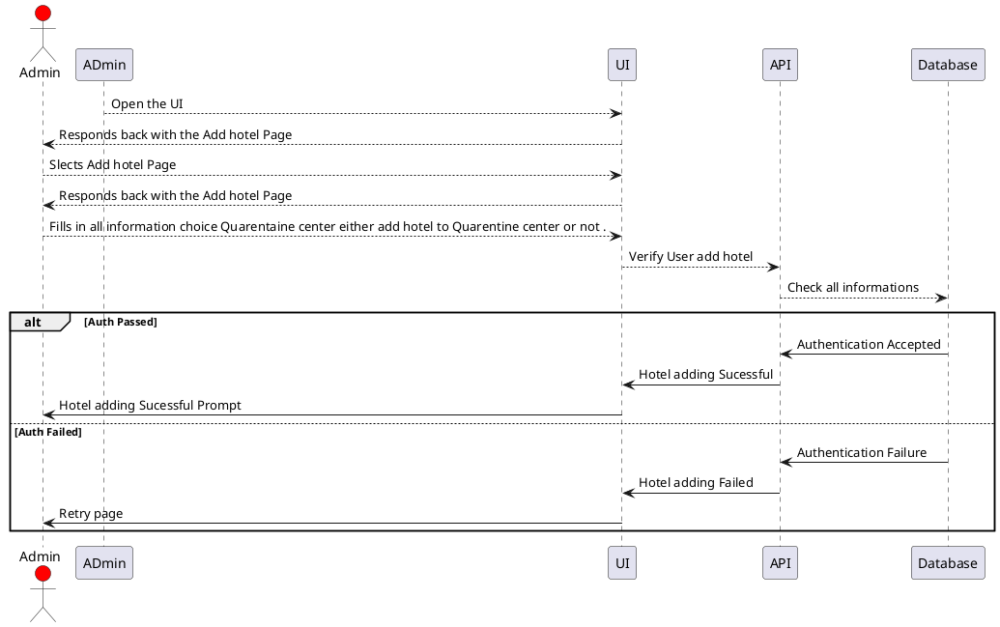


#### 3.2.13 Sequence Daigram for update hotel for an Admin User


#### 3.2.14 Sequence Daigram for booking history for an Admin User

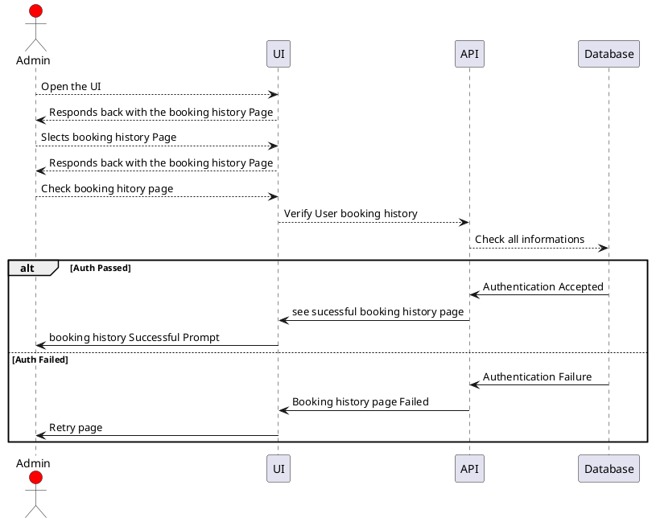
#### 3.2.15 Sequence Daigram for check in for a Customer User

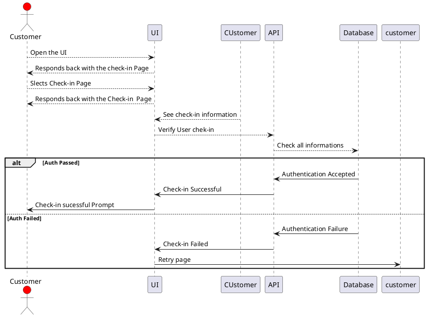
#### 3.2.16 Sequence Daigram for check-out for a Customer User

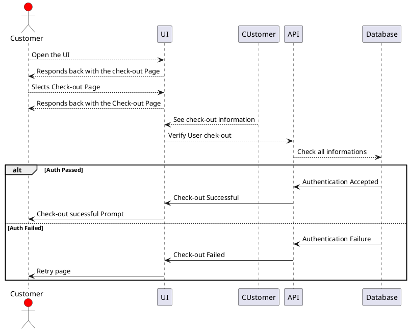
#### 3.2.17 Sequence Daigram for unique advantage for a Customer User

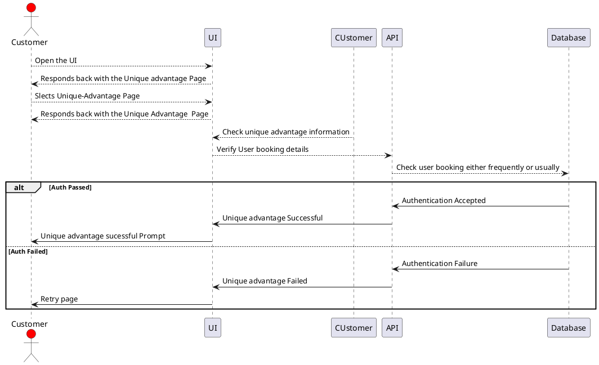
### **3.3 Activity Daigram**
#### 3.3.1 Activity Daigram for User Login

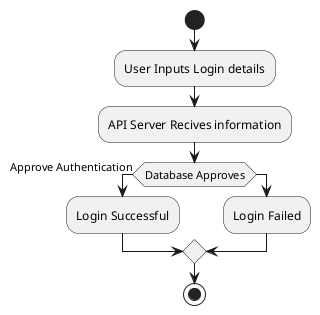
#### 3.3.2 Activity Daigram for User sign-up

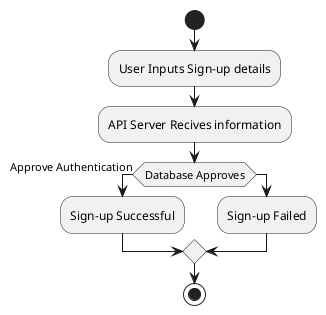
#### 3.3.3 Activity Daigram for User LogOut

```plantuml
@startuml
start
:User Inputs Logout details;
:API Server Recives information;
if (Database Approves) then (Approve Authentication)
  :Logout Successful;
else
:Logout Failed;
endif
stop

@enduml
```
#### 3.3.4 Activity Daigram for User create booking

```plantuml
@startuml
start
:User Inputs booking details;
:API Server Recives information;
if (Database Approves) then (Approve Authentication)
  :booking Successful;
else
:booking Failed;
endif
stop

@enduml
```
#### 3.3.5 Activity Daigram for User cancel booking

```plantuml
@startuml
start
:User Inputs bookig details;
:API Server Recives information;
if (Database Approves) then (Approve Authentication)
  :booking cancelling Successful;
else
:booking cancelling Failed;
endif
stop

@enduml
```
#### 3.3.5 Activity Daigram for User update booking

```plantuml
@startuml
start
:User Inputs booking details;
:API Server Recives information;
if (Database Approves) then (Approve Authentication)
  :booking updation Successfull;
else
:booking updation Failed;
endif
stop

@enduml
```
#### 3.3.6 Activity Daigram for User forget password

```plantuml
@startuml
start
:User Inputs email details;
:API Server Recives information;
if (Database Approves) then (Approve Authentication)
  :showing password;
else
:password showing Failed;
endif
stop

@enduml
```
#### 3.3.7 Activity Daigram for Add hotel

```plantuml
@startuml
start
:User Inputs add hotel details;
:API Server Recives information;
if (Database Approves) then (Approve Authentication)
  :Add hotel Successful;
else
:Add hotel Failed;
endif
stop

@enduml
```
#### 3.3.8 Activity Daigram for User update hotel 

```plantuml
@startuml
start
:User Inputs update hotel details;
:API Server Recives information;
if (Database Approves) then (Approve Authentication)
  :Hotel updation Successful;
else
:Hotel updation Failed;
endif
stop

@enduml
```
#### 3.3.9 Activity Daigram for User booking history 

```plantuml
@startuml
start
:User Inputs booking history details;
:API Server Recives information;
if (Database Approves) then (Approve Authentication)
  :booking history Successful;
else
:booking history Failed;
endif
stop

@enduml
```
#### 3.3.10 Activity Daigram for User check-in  

```plantuml
@startuml
start
:User Inputs check-in details;
:API Server Recives information;
if (Database Approves) then (Approve Authentication)
  :check-in Successful;
else
:check-in Failed;
endif
stop

@enduml
```
#### 3.3.11 Activity Daigram for User check-out 

```plantuml
@startuml
start
:User Inputs check-out details;
:API Server Recives information;
if (Database Approves) then (Approve Authentication)
  :check-out Successful;
else
:check-out Failed;
endif
stop

@enduml
```
#### 3.3.12 Activity Daigram for User add hotel as Quarentine center 

```plantuml
@startuml
start
:User Inputs select Quarentine center details;
:API Server Recives information;
if (Database Approves) then (Approve Authentication)
  :Add hotel as Quarentine center Successful;
else
:Add hotel as Quarentine center Failed;

endif
stop

@enduml
```
#### 3.3.13 Activity Daigram for User Feedback mail after check-out 

```plantuml
@startuml
start
:User Inputs check-out details and send a feedback mail;
:API Server Recives information;
if (Database Approves) then (Approve Authentication)
  :send feedback mail Successful;
else
:send feedback mail  Failed;
endif
stop

@enduml
```
#### 3.3.14 Activity Daigram for User Unique Advantage 

```plantuml
@startuml
start
:User Inputs booking history details and frequent customer has unique advantage;
:API Server Recives information;
if (Database Approves) then (Approve Authentication)
  :unique advantage Successful;
else
:unique advantage  Failed;
endif
stop
@enduml
```
### **3.4 Component Daigram**

```plantuml
component as [Hotel-Mangement-UI]
component as [Hotel-Mangement-API]
```
### **3.5 Flowchart**
#### 3.5.1  Flowchart for a Customer
```plantuml
@startuml
:Customer;  
   fork
   :New Customer in our System;
   :Sign-up; 
   :Searching hotels;
   :Create-booking;
   :go to booking-history page;
   :log-out;
stop
 fork again
   :Already a customer in our system;
   :Log-in;
    fork 
   :Searching hotels;
   :Create-booking;
   :go to booking-history page;
   :log-out;
stop
    fork again
     :cancel booking;
     :booking-history page;
     :booking-cancelled;
     :booking-history page;
     :log-out;
stop
    fork again
     :update booking;
    :booking history page;
    :booking-updated;
    :log-out;
stop
    fork again
    :forget password;
    : go to forget-password page;
     :give registered emailid;
     :show password;    
stop     
@enduml
```
#### 3.5.2 Flowchart for an Admin in our System
```plantuml
@startuml
:Admin; 
   fork
   :New Admin in our System;
   :Sign-up; 
   :Add hotels;
   :give informations;
   :Hotel Added;
   :log-out;
stop
 fork again
   :Already an Admin in our system;
   :Log-in;
    fork 
   :Add hotels;
   :Give information;
   :Hotel Added;
   :log-out;
stop
    fork again
     :Update hotel
     :give information;
     :Hotel updated;
     :log-out;
stop
    fork again
    :booking history page;
    :log-out;
stop
@enduml
```
## **4. User Journeys**
###  4.1 Current Requierments
#### 4.1.1 Customer sign up and login
A User, who is a normal customer for the Hotel Management system that we are creating should be allowed to create a unique session upon Login. If a customer does not have an account on the system, then he should be allowed to sign up with his own unique email id which has used for registration previously. He should add the details requested along with a valid 10 digit mobile number and a password that is Alphanumeric and contains atleast 8 letters, a special character and 3 digits. 
### 4.1.2 Admin Signup and login
A User, who is a normal Admin for the Hotel Management system that we are creating should be allowed to create a unique session upon Login. If a customer does not have an account on the system, then he should be allowed to sign up with his own unique email id which has used for registration previously. He should add the details requested along with a valid 10 digit mobile number and a password that is Alphanumeric and contains atleast 8 letters, a special character and 3 digits. 
#### 4.1.3 Customer logout
A User, who is a  customer for the Hotel Management system want to logout from our website simply click on logout button , a message is shown in our website he is logged-out sucessfully.
Then ,when he can book any hotel through our website in future, he must be signup in our website as above mentioned  process ,it is mandatory for all customer.
#### 4.1.4 Admin logout
A User, who is an Admin for the Hotel Management system want to logout from our website simply click on logout button , a message is shown in our website he is logged-out sucessfully.
Then ,when he can book any hotel through our website in future, he must be signup in our website as above mentioned  signuprocess ,it is mandatory for all customer.
#### 4.1.5 Customer create booking ,update booking, canccel booking
A User, who is a customer for the Hotel Management system want to book a hotel in any place,at first he can choice any hotel, if he founds a Quarentine center then it is avaliable in our aystem also.He choices a hotel  and sees the hotel rent per day then goes to the create booking page and fills the all necessary informations, he adds his name, registered emailid,contact number etc and books a hotel sucessfully.After,he wants to update his booking (change hotel,change booking date etc)simply goes to the update booking page and then fills all informations or change some information and updates booking sucessfully.The Customrer somehow wants to cancel his booking goes to the cancel booking page and simply clicks on cancel booking link and a message is shown in our website and then checks the booking history page to see there must be no booking is avaliable there. 

#### 4.1.6 Admin Add hotel ,update hotel, manage hotel
A User, who is an Admin for the Hotel Management system want to add a hotel in any place,at first he wants to add  any hotel, if he adds this hotel as a Quarentine center then selects the option Quarentine center .He adds a hotel  and also add the hotel rent per day then goes to the add hotel page and fills the all necessary informations, he adds his name, registered emailid,contact number etc and adds a hotel sucessfully.After,he wants to update his hotel or add some new hotel(change hotel,change anything etc)simply goes to the update hotel page and then fills all informations or change some information and updates hotel sucessfully.The Admin always sees the customer's booking history to go to the booking history page to manage his hotel's room free in customer's check-in time and also gave reminder to customer in his check-out time.
#### 4.1.7 Customer checck in and check out
Check-in is used to admit a customer in our Hotel after entering his all personal details like Name, Address, Phone, Sex and then he/she is assigned a room.Check-out is used to checkout the customer details from database. When the user inputs his room number, the same room number will be checked in the database, if the room number is matched in the database, then the customer will be check-out from the database and transferred the record of the checkout to another table of database so that the Hotel Management has the record of customers who have check-out to fulfill his legal liabilities.
#### 4.1.8 Listing of avaliable hotels
A User, who is a customer for the Hotel Management system want to see list of avaliable hotels in different cities,different places simply go to our hotel front page and choose any place as his wish,there many places hotels are avaliable and see all hotels images,name,rent per day ,and also see the hotel is either Quarentine center or not.
### 4.2 Future Application
#### 4.2.1 #### Unique Advantage
 Any Customers who book hotels by our website frequently ,they have a unique advantage by our side. A customer who books our hotel 5th times,when he books hotel at 6th times ,he gets 5% discount from our side and also a customer who books our hotel 10th times,when he books hotel at 11th times ,he gets 15% discount from our side.   
#### 4.2.2 Feedback page
Customers have a feedback mail after check-out from hotels to give any feedback message to us ,they log in by their registered email and password and give messages how is the food,how our services write through feedback page to us.
#### 4.2.3 Generate bill
When any customer check-out, his/her bill is generated automatically by calculated check-out date minus check-in date and getting multiplied it by daily room charge plus other charges and the bill has to be saved in the table in the database.
### 4.3 Scope of Improvement
Now a days hotel are providing many other facilities, this project can also be improved with the improvement in the Hotels.Utmost care and back-up procedures must be established to ensure 100% successful implementation of the computerized banking system. In case of system failure, the organization should be in a position to process the transaction with another organization or if the worst comes to the worst, it should be in a position to complete it manually
## 5.**CONCLUSION**
This project is designed to meet the requirements of Online Hotel Managent System.
For designing the system we have used simple diagrams.
overall the project teaches us the essential skills like:
Using system analysis and design techniques like usercase diagramagram ,sequence diagram,Activity Diagram etc in designing the system.
Understanding the database handling and query processing
#### REFERENCE
1.	https://www.w3schools.com/
2.   https://www.javatpoint.com/


 


 


    


